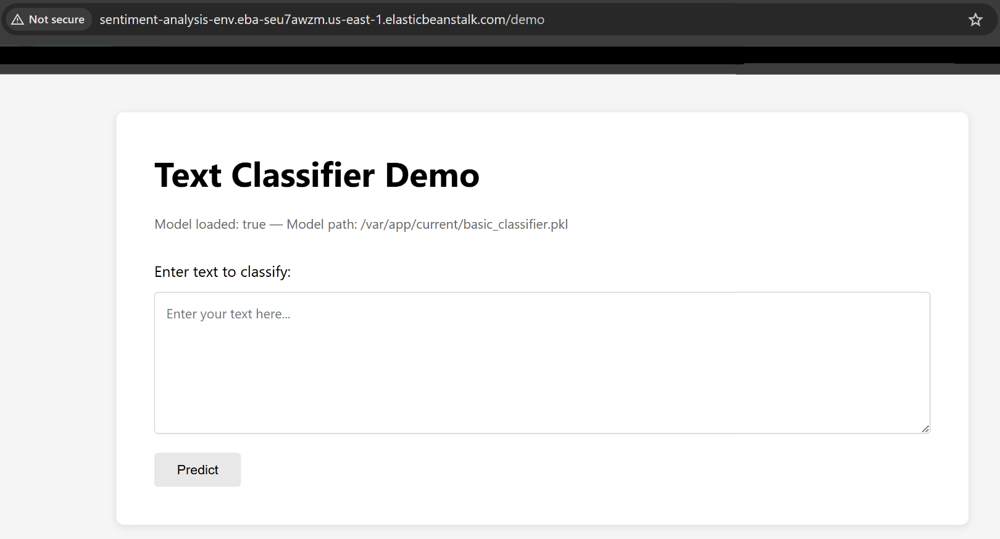

# E444-F2025-PRA5

## Activity 4 - Environment Creation

## Application Run Locally

## Activity 5 - Deployed Application on AWS

## Functional Testing

## Performance Testing
* Box plot of the API latency per test case.

